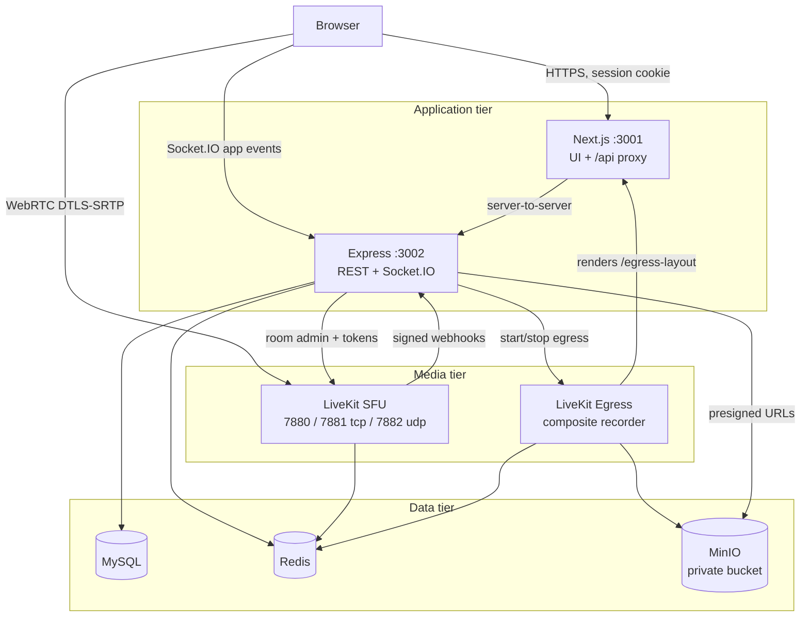
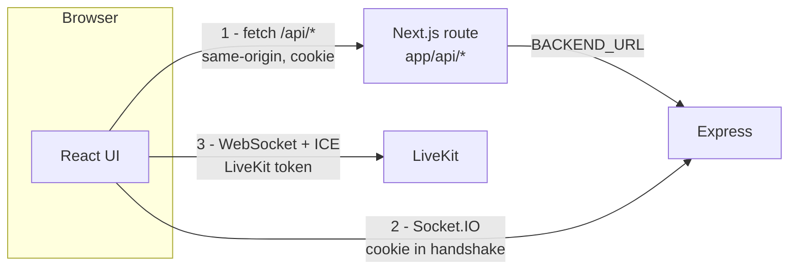
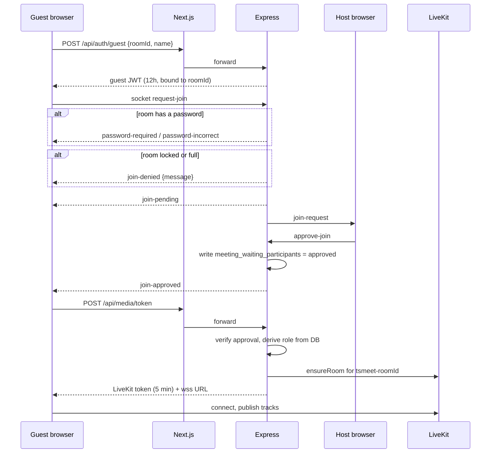
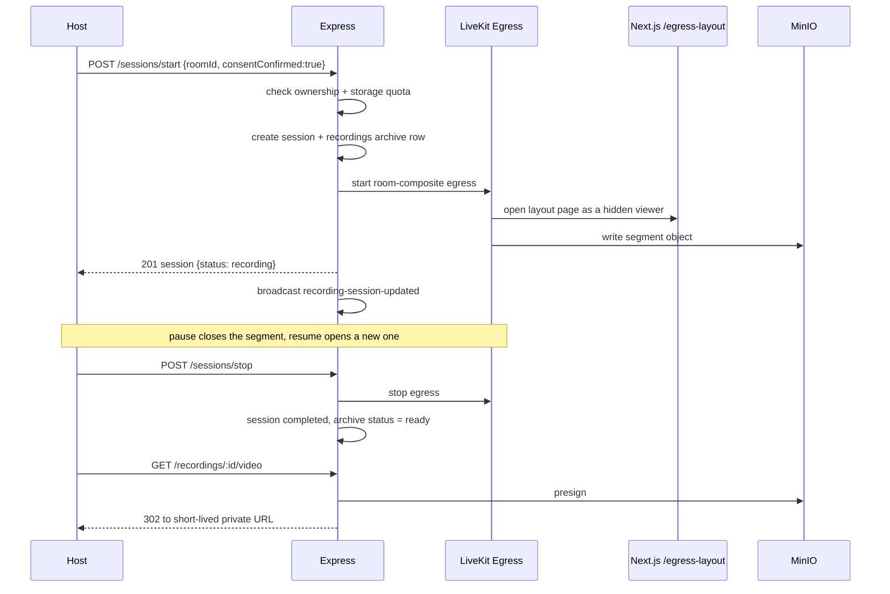
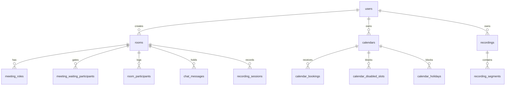

# TSMeet Architecture

How TSMeet is put together, why it is shaped this way, and where the boundaries
are. Read this before changing media, authentication, or room state.

**Contents**

- [The one-paragraph version](#the-one-paragraph-version)
- [Runtime topology](#runtime-topology)
- [Why media and signalling are separate](#why-media-and-signalling-are-separate)
- [Request paths](#request-paths)
- [Joining a meeting, end to end](#joining-a-meeting-end-to-end)
- [Recording pipeline](#recording-pipeline)
- [State ownership](#state-ownership)
- [Data model](#data-model)
- [Security model](#security-model)
- [Scaling limits](#scaling-limits)
- [Deployment topology](#deployment-topology)
- [Repository map](#repository-map)

---

## The one-paragraph version

TSMeet is a modular monolith. A Next.js app serves the UI and proxies every
browser API call; an Express app owns REST, Socket.IO, and all authorisation;
a self-hosted LiveKit SFU carries all audio and video; MySQL holds durable data
and Redis coordinates Socket.IO across processes. Recording is done server-side
by LiveKit Egress into a private MinIO bucket. Nothing in the media path depends
on a managed communications API.

---

## Runtime topology



| Component | Port | Responsibility |
|---|---|---|
| Next.js frontend | 3001 | UI, same-origin `/api` proxy, Egress layout page |
| Express backend | 3002 | REST, Socket.IO, all authorisation decisions |
| LiveKit SFU | 7880 / 7881 / 7882 | Every audio, video, and screen track |
| LiveKit Egress | — | Server-side composite recording |
| MySQL | 3306 | Users, rooms, calendars, bookings, recordings, audit log |
| Redis | 6379 | Socket.IO adapter, LiveKit and Egress coordination |
| MinIO | 9000 | Private recording object store |

Ports above are **container-internal**. The default Compose file publishes some
of them on different host ports — MySQL on `13306`, MinIO on `9100`/`9101` — so
check `docker-compose.yml` before connecting from the host.

---

## Why media and signalling are separate

This is the central design decision, recorded in
[ADR 0001](docs/adr/0001-self-hosted-livekit-sfu.md).

**Mesh WebRTC does not scale.** With peer-to-peer connections, every participant
uploads their camera once per other participant. At 10 people that is 9 upload
streams from a laptop on home broadband. Adding a recorder made it 10.

**An SFU fixes the upload side.** Each browser publishes each track exactly once
to LiveKit and subscribes only to the tracks and simulcast layers the current
layout actually needs. Off-screen tiles are unsubscribed or paused. The server
does not decode and re-encode anything for normal meetings, so CPU cost per room
stays modest.

The consequence for the codebase: **Socket.IO and LiveKit have strictly separate
jobs.**

| Concern | Transport |
|---|---|
| Audio, video, screen share | LiveKit only |
| Waiting room, admit/deny | Socket.IO only |
| Chat, hand raise, presence | Socket.IO only |
| Mute/remove/lock/end | Socket.IO command, LiveKit enforcement |
| Recording status broadcast | Socket.IO only |

A mesh provider still exists in [`hooks/useWebRTC.ts`](hooks/useWebRTC.ts) as a
controlled rollback path for small rooms. It is opt-in per room through
`MEDIA_PROVIDER_MESH_ROOMS` and capped at `MAX_MESH_PARTICIPANTS` (8). Do not add
browser-to-browser connections to normal rooms.

---

## Request paths

There are three distinct paths, and mixing them up is the most common source of
bugs.



1. **REST through the proxy.** The browser only ever calls its own origin. The
   `tsmeet_session` cookie is HttpOnly, so JavaScript cannot read or leak it, and
   Express needs no permissive CORS for browsers. See
   [`app/api/_proxy.ts`](app/api/_proxy.ts).
2. **Socket.IO direct to Express.** The handshake carries the same cookie.
3. **LiveKit direct.** Authorised by a five-minute token that Express mints only
   after checking waiting-room approval.

---

## Joining a meeting, end to end



The key property: **the waiting room is the authorisation gate for media, not a
UI courtesy.** `POST /api/media/token` re-checks the database. A client that
skips the socket flow, or forges `isHost`, still cannot obtain a publishing
token. Roles are derived only from `rooms.creator_id` and `meeting_roles`;
client-supplied role fields are discarded.

---

## Recording pipeline

Recording is **server-side**. No browser uploads media, and no hidden participant
joins the room to capture it.



Design points worth keeping:

- **Consent is enforced by the API**, not only the UI. `consentConfirmed: true`
  is required or the request is rejected with `400`.
- **Pause/resume produces segments.** One archive row can own several
  `recording_segments` rows. Do not assume one file per recording.
- **The bucket stays private.** Downloads go through a `302` to a short-lived
  presigned URL after an ownership check. There is no public object.
- **Quota is checked on start and on resume**, returning `507` with
  `RECORDING_STORAGE_FULL`.
- **Sessions survive a restart.** Unfinished `recording_sessions` rows are
  rehydrated during backend startup.

---

## State ownership

This is where the important limitation lives.

| State | Home | Durable? |
|---|---|---|
| Users, rooms, calendars, bookings, recordings | MySQL | yes |
| Waiting-room approvals, meeting roles | MySQL | yes |
| Audit log | MySQL `security_audit_logs` | yes |
| Socket.IO fan-out between processes | Redis adapter | n/a |
| Live participant list, host socket, co-host set, pending queue | **`RoomManager` process memory** | **no** |
| Published tracks, subscriptions, simulcast layers | LiveKit | no |

> **Run one backend replica.** [`RoomManager`](server/services/roomManager.ts)
> keeps live room authority in memory. The Redis adapter distributes Socket.IO
> *packets* between processes — it does not make in-memory room state shared. Two
> replicas would disagree about who the host is. Moving this state into a shared
> presence store is the prerequisite for horizontal scaling of the API tier.

The durable half is deliberately in MySQL: waiting-room approval and co-host
assignment must outlive a socket reconnect, because `POST /api/media/token` reads
them to decide whether to issue a publishing token.

**Host failover.** If the host socket drops, `RoomManager` promotes a replacement
and broadcasts `host-changed`. When the authenticated creator reconnects they
reclaim host ownership, so a temporary fallback host never permanently takes over
someone else's meeting.

---

## Data model

Schema is created and migrated at backend startup by
[`server/db.ts`](server/db.ts), tracked in `schema_migrations`.



| Table | Purpose |
|---|---|
| `users` | Accounts and guest identities (`bcrypt` password hashes) |
| `rooms` | Meetings, optional password hash, `is_locked`, `ended_at` |
| `meeting_roles` | Co-host assignments that survive reconnects |
| `meeting_waiting_participants` | Waiting-room decisions; read by the token endpoint |
| `room_participants` | Join/leave history |
| `chat_messages` | In-meeting chat |
| `calendars`, `calendar_bookings`, `calendar_disabled_slots`, `calendar_holidays` | Scheduling |
| `recordings`, `recording_sessions`, `recording_segments` | Recording archive and lifecycle |
| `livekit_webhook_events` | Processed webhook IDs, for idempotent retries |
| `security_audit_logs` | Every moderation and recording action |
| `schema_migrations` | Applied migration tracking |

**A compatibility note for contributors.** Queries in `server/routes/` are
written in Postgres style — `$1` placeholders and `INSERT ... RETURNING`.
[`server/db.ts`](server/db.ts) translates them to MySQL at runtime. Follow the
existing style rather than mixing `?` placeholders into the same file.

**Booking concurrency.** Availability check and insert run inside a MySQL
advisory lock scoped to the calendar, so two simultaneous requests for the last
seat cannot both succeed across API processes.

---

## Security model

| Layer | Control |
|---|---|
| Session | HttpOnly `tsmeet_session` cookie; Secure and explicit `SameSite` in production |
| Token storage | JWTs are **not** kept in `localStorage` on the LiveKit path |
| Passwords | bcrypt for both accounts and room passwords |
| SQL | Parameterised queries throughout |
| Input | Zod validation on auth and calendar payloads; 256 KB body cap |
| Headers | Helmet |
| Rate limits | 30 per 15 min on `/api/auth`; 120 per min on `/api/public` |
| CORS | Restricted to `FRONTEND_URL` |
| Media authorisation | Server-derived roles only; five-minute LiveKit tokens |
| Guest scope | Guest JWTs are bound to one `roomId` |
| Media encryption | WebRTC DTLS-SRTP in transit |
| Webhooks | LiveKit signature verification on a raw body |
| Recording storage | Private bucket, ownership check, presigned short-lived URLs |
| Auditing | Moderation and recording actions written to `security_audit_logs` |

Secrets that must never reach browser code, logs, or the repository:
`JWT_SECRET`, `LIVEKIT_API_SECRET`, `RECORDER_SERVICE_TOKEN`, Redis passwords,
MinIO credentials, and generated production LiveKit YAML.

See [SECURITY.md](SECURITY.md) for vulnerability reporting.

---

## Scaling limits

Be honest about these when sizing a server.

| Limit | Value | Source |
|---|---|---|
| Verified participants per room | **20** on an 8-vCPU node | [capacity doc](docs/CAPACITY_AND_SCALING.md) |
| Application room cap | 50 (`MAX_PARTICIPANTS`) | a configured ceiling, not a tested one |
| Mesh rollback cap | 8 (`MAX_MESH_PARTICIPANTS`) | rollback rooms only |
| Backend replicas | **1** | in-memory `RoomManager` |
| Room placement | one room fits on one SFU node | rooms are not split |

`MAX_PARTICIPANTS=50` is the default ceiling the application enforces. It is not
a promise that 50 people will have a good call on your hardware — the tested
figure on the reference node is 20. Read
[docs/CAPACITY_AND_SCALING.md](docs/CAPACITY_AND_SCALING.md) before you promise
anyone a number.

---

## Deployment topology

`docker-compose.yml` defines the full stack; most of it is behind profiles.

| Profile | Services |
|---|---|
| default | `frontend`, `backend`, `mysql`, `redis`, `livekit` |
| `recording` | `minio`, `minio-init`, `egress` |
| `observability` | `prometheus`, `grafana`, `loki`, `promtail`, `cadvisor`, `node-exporter`, `mysql-exporter`, `redis-exporter` |

Production overlays with `docker-compose.production.yml` and requires
`JWT_SECRET`, `LIVEKIT_API_KEY`/`LIVEKIT_API_SECRET`, and — if recording is
enabled — MinIO credentials.

Two-domain public layout:

```text
meet.example.com   -> Nginx -> frontend:3001
api.example.com    -> Nginx -> backend:3002 + LiveKit WebSocket
VPS 7882/udp       -> LiveKit UDP mux
VPS 7881/tcp       -> LiveKit ICE/TCP fallback
```

UDP mux on a single port replaces the old `50000-60000` range, avoiding thousands
of Docker NAT rules. Do not reintroduce the wide range. Details in
[docs/PRODUCTION_NETWORKING.md](docs/PRODUCTION_NETWORKING.md) and
[VPS_DEPLOYMENT_GUIDE.md](VPS_DEPLOYMENT_GUIDE.md).

Run `pnpm check` (lint, typecheck, test, build) before deploying.

---

## Repository map

| Path | Contents |
|---|---|
| [`app/`](app/) | Next.js routes, meeting UI, dashboard, `/api` proxy, `/egress-layout` |
| [`components/`](components/) | UI components; `components/ui/` is the shadcn layer |
| [`hooks/`](hooks/) | `useLiveKitRoom` (primary media), `useWebRTC` (mesh rollback), `useMeetingMedia` |
| [`lib/`](lib/) | Shared client logic: media network policy, recording contract |
| [`server/routes/`](server/routes/) | Express REST handlers |
| [`server/services/`](server/services/) | LiveKit, Egress, object storage, room manager, metrics, audit |
| [`server/index.ts`](server/index.ts) | Route mounting and every Socket.IO handler |
| [`server/db.ts`](server/db.ts) | Pool, schema migrations, Postgres-to-MySQL query shim |
| [`infrastructure/`](infrastructure/) | LiveKit YAML, Prometheus/Grafana/Loki, systemd timers |
| [`deploy/`](deploy/) | VPS provisioning and Nginx templates |
| [`scripts/`](scripts/) | Runtime acceptance probes |
| [`docs/`](docs/) | Operations, capacity, networking, backup, ADRs |
