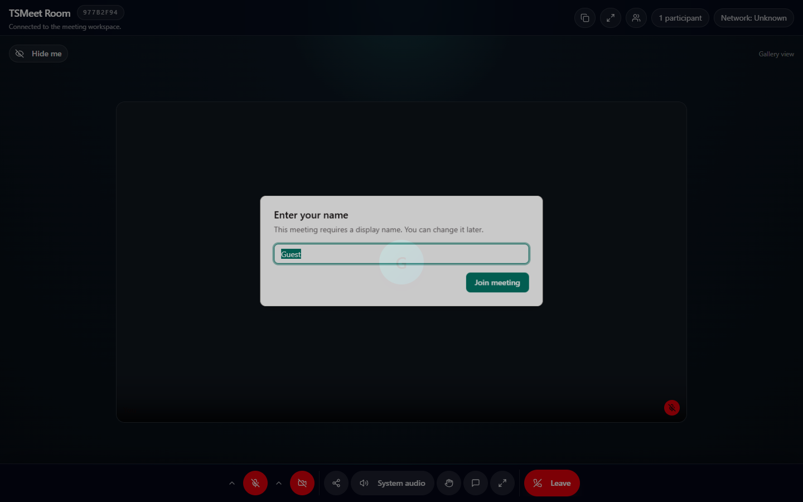
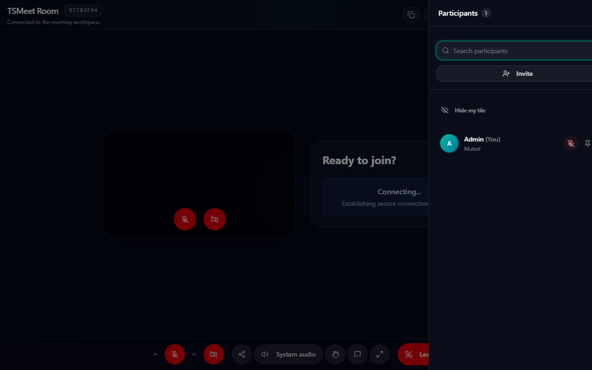
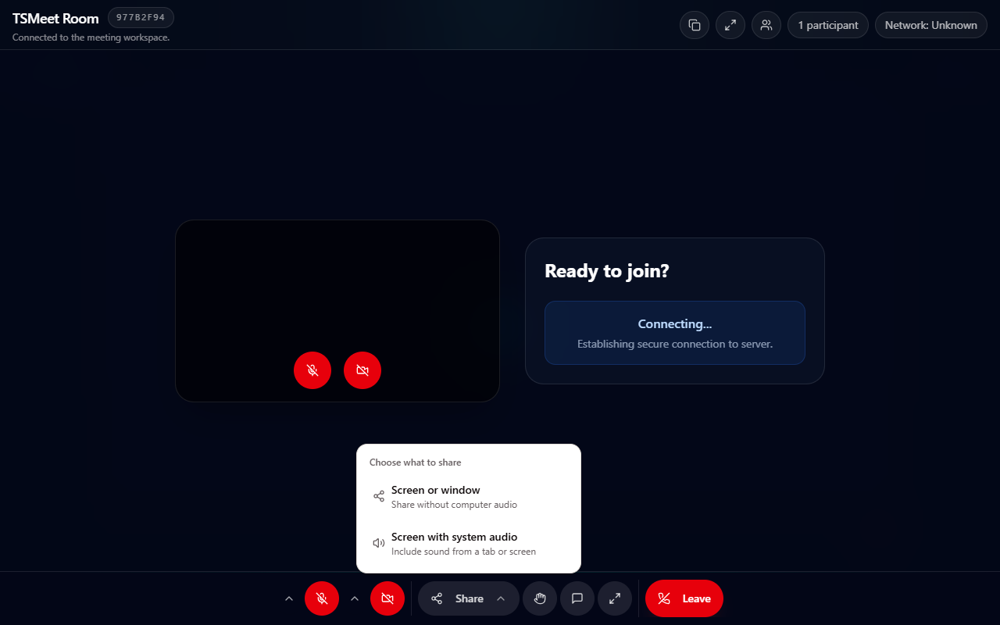
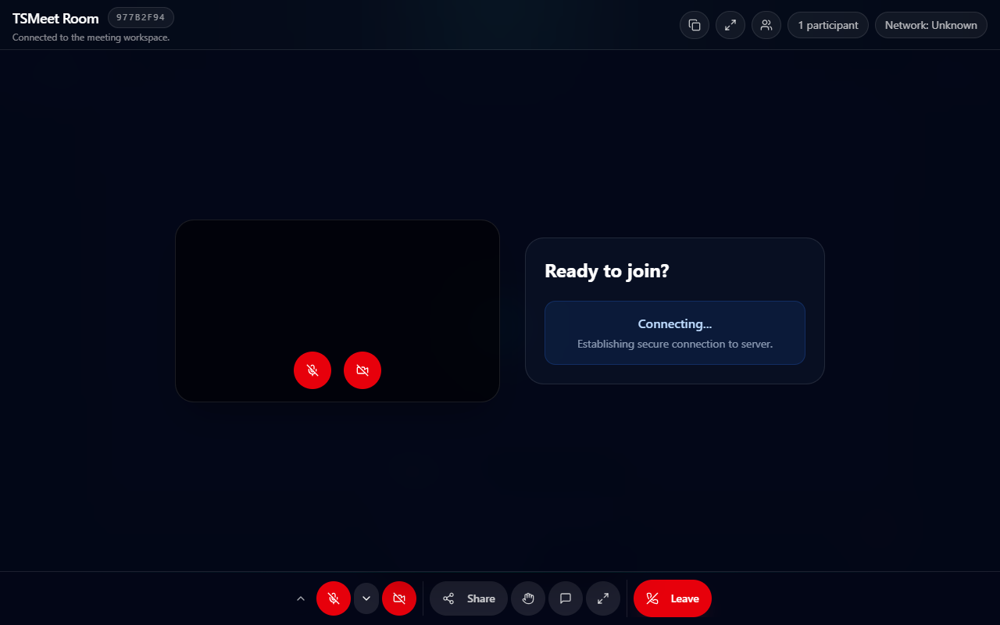
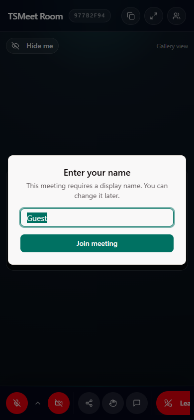

<h1 align="center">TSMeet</h1>

<p align="center">
  <strong>Self-hosted video meetings, scheduling, and recording — on your own server.</strong>
</p>

<p align="center">
  
  
  
  
  
</p>

<p align="center">
  
</p>

TSMeet is a Zoom / Google Meet–style web application you run yourself. Meeting
media flows through a **self-hosted LiveKit SFU**; presence, moderation, waiting
room, and chat run over Socket.IO. There is no LiveKit Cloud, Twilio, Agora, or
Daily dependency — you pay for a server, not per minute.

---

## Contents

| I want to… | Go to |
|---|---|
| See what it does | [Features](#features) · [Screenshots](#screenshots) |
| Try it in 5 minutes | [Quick start](#quick-start-with-docker) |
| Learn to host a meeting | [User guide](docs/USER_GUIDE.md) |
| Develop against it | [Setup guide](SETUP_GUIDE.md) · [API reference](API.md) |
| Understand the design | [Architecture](ARCHITECTURE.md) |
| Deploy to a real server | [VPS deployment guide](VPS_DEPLOYMENT_GUIDE.md) |
| Operate it in production | [Operations handbook](docs/OPERATIONS_HANDBOOK.md) |
| Contribute | [Contributing](CONTRIBUTING.md) · [Security policy](SECURITY.md) |

---

## Features

### Meeting experience

- Camera and microphone preview before joining, with device selection for
  microphones, cameras, and speakers
- Gallery, active-speaker, pinned-participant, and hide-your-own-tile layouts
- Screen sharing for a tab, window, or whole screen — with optional system audio
- Adaptive video quality and a low-data mode that react to network conditions
- In-meeting chat, hand raising, participant status, responsive mobile layout

### Host and moderation controls

- Waiting room with admit, deny, and request-again
- Mute all, stop video, remove participant, lock meeting
- Co-host assignment, host transfer, end meeting for everyone
- Searchable participant panel with host, mute, and raised-hand indicators
- Recording consent prompt with start / pause / resume / stop

### Scheduling and accounts

- Registration, sign-in, and a protected dashboard
- Rooms with titles and optional passwords
- Calendar availability, holidays, public booking pages, confirmations,
  cancellations — including `personal`, `event`, and `round_robin` calendars
- Guest access through a shareable link, no account required
- Meeting history and a private recording archive with download and delete

Full inventory: [FEATURES.md](FEATURES.md).

---

## Screenshots

<table>
  <tr>
    <td width="50%">
      
      <p align="center"><em>Participants panel — search, invite, mute, pin</em></p>
    </td>
    <td width="50%">
      
      <p align="center"><em>Screen share, with or without system audio</em></p>
    </td>
  </tr>
  <tr>
    <td width="50%">
      
      <p align="center"><em>Camera and layout options</em></p>
    </td>
    <td width="50%">
      
      <p align="center"><em>Responsive down to 320&nbsp;px</em></p>
    </td>
  </tr>
</table>

---

## Architecture at a glance

```text
Browser
  |-- HTTPS / same-origin /api proxy --> Next.js frontend :3001
  |-- Socket.IO application events ----> Express backend :3002
  `-- WebRTC media (WSS + ICE) --------> LiveKit SFU

Express <--> MySQL (durable data)
Express / Socket.IO / LiveKit / Egress <--> Redis (coordination)
LiveKit Egress --> private MinIO bucket (optional recording)
```

Each browser publishes its tracks **once** to LiveKit and subscribes only to the
tracks and simulcast layers the current layout needs. The server does not merge
every camera into one stream. Production media uses LiveKit UDP mux on
`7882/udp` with TCP fallback on `7881/tcp`, avoiding a wide UDP range and
thousands of Docker NAT rules.

Diagrams and the full design rationale: [ARCHITECTURE.md](ARCHITECTURE.md).

---

## Quick start with Docker

**Prerequisite:** Docker Desktop or Docker Engine with the Compose plugin.

```bash
git clone https://github.com/tanvirahmmed8/tsmeet.git
cd tsmeet
cp .env.example .env                 # PowerShell: Copy-Item .env.example .env
# Replace every change-me value in .env before starting.
docker compose up -d --build
docker compose ps
```

Open **http://localhost:3001**, register an account, and create a room.

| Service | Purpose | Local endpoint |
|---|---|---|
| `frontend` | Next.js UI and same-origin API proxy | `http://localhost:3001` |
| `backend` | Express REST API and Socket.IO | `http://localhost:3002` |
| `mysql` | Application database | `127.0.0.1:13306` |
| `redis` | Socket.IO / LiveKit coordination | internal Compose network |
| `livekit` | SFU media server | `ws://localhost:7880` |

Recording and observability are **off by default** — they are heavy. Turn them on
only on a larger machine: [docs/OPTIONAL_DOCKER_PROFILES.md](docs/OPTIONAL_DOCKER_PROFILES.md).

> `docker compose down` preserves your named volumes. Never run `down -v` on a
> deployment you care about — it deletes the database.

---

## Local development without Docker for the app

Run MySQL, Redis, and LiveKit in Docker, then the two app processes on your host:

```bash
docker compose up -d mysql redis livekit

pnpm install
pnpm dev                               # frontend on :3001

cd server
pnpm install
pnpm run dev                           # backend on :3002
```

The backend creates and migrates the database schema at startup. Environment
variables and smoke tests: [SETUP_GUIDE.md](SETUP_GUIDE.md).

---

## Authentication and security

- Browser login uses an HttpOnly `tsmeet_session` cookie
- Authenticated browser REST calls go through same-origin Next.js `/api` proxy routes
- JWT and LiveKit API secrets stay server-side; JWTs are not stored in `localStorage`
- LiveKit join tokens live for five minutes and are only issued after waiting-room approval
- Roles are derived from database state — a client cannot claim to be host
- Media is encrypted in transit with WebRTC DTLS-SRTP
- Passwords are bcrypt-hashed; every database query is parameterised
- Moderation and recording actions are written to an audit log

Reporting a vulnerability: [SECURITY.md](SECURITY.md).

---

## Capacity — read before you promise anyone a number

| Figure | Value | What it means |
|---|---|---|
| **Verified** | **20 participants** | Measured on an 8-vCPU node: 38.1 Mbps aggregate, 0% packet loss |
| Application cap | 50 (`MAX_PARTICIPANTS`) | A configured ceiling, **not** a tested guarantee |
| Mesh rollback cap | 8 (`MAX_MESH_PARTICIPANTS`) | Legacy rollback rooms only |
| Backend replicas | 1 | Live room state is in process memory |

The 50-participant attempt did **not** pass on the reference node — ICE
connections timed out past 20 publishers. Treat 50 as a product target and size
your hardware from the measurements in
[docs/CAPACITY_AND_SCALING.md](docs/CAPACITY_AND_SCALING.md).

**Operating cost.** The software and the whole media stack are self-hosted and
require no managed communications API. You still pay for the VPS, bandwidth,
domains, TLS, and storage you choose.

---

## Deployment

For a two-domain VPS deployment, follow
[VPS_DEPLOYMENT_GUIDE.md](VPS_DEPLOYMENT_GUIDE.md):

```text
meet.example.com    -> Nginx -> frontend:3001
api.example.com     -> Nginx -> backend:3002 and LiveKit WebSocket
public VPS 7882/udp -> LiveKit UDP mux
public VPS 7881/tcp -> LiveKit ICE/TCP fallback
```

After changing hooks or `NEXT_PUBLIC_*` values, rebuild the frontend. After
changing LiveKit YAML or published ports, recreate LiveKit. Never use `down -v`
or delete database volumes during a routine deployment.

---

## Developer commands

```bash
pnpm lint          # ESLint
pnpm typecheck     # tsc for both the app and server projects
pnpm test          # service, media-policy, and storage test suites
pnpm build         # production Next.js build
pnpm check         # all four, in order — run this before deploying
```

---

## Documentation

**For people using TSMeet**

| Document | What it covers |
|---|---|
| [docs/USER_GUIDE.md](docs/USER_GUIDE.md) | Hosting and joining meetings, moderation, recording, booking pages |
| [FEATURES.md](FEATURES.md) | Complete feature inventory |

**For developers**

| Document | What it covers |
|---|---|
| [SETUP_GUIDE.md](SETUP_GUIDE.md) | Local and Docker setup, environment variables, smoke tests |
| [ARCHITECTURE.md](ARCHITECTURE.md) | Components, request paths, state ownership, data model, security |
| [API.md](API.md) | REST, proxy, and Socket.IO contracts |
| [CONTRIBUTING.md](CONTRIBUTING.md) | Branching, testing checklist, review expectations |

**For operators**

| Document | What it covers |
|---|---|
| [VPS_DEPLOYMENT_GUIDE.md](VPS_DEPLOYMENT_GUIDE.md) | Production VPS, TLS, DNS, firewall, updates |
| [docs/OPERATIONS_HANDBOOK.md](docs/OPERATIONS_HANDBOOK.md) | Daily checks, incident response, rollback, shutdown |
| [docs/PRODUCTION_NETWORKING.md](docs/PRODUCTION_NETWORKING.md) | LiveKit ports, TURN, certificates |
| [docs/CAPACITY_AND_SCALING.md](docs/CAPACITY_AND_SCALING.md) | Measured capacity and server sizing |
| [docs/STORAGE_BACKUP_AND_RESTORE.md](docs/STORAGE_BACKUP_AND_RESTORE.md) | Recording backup and restore drills |
| [docs/OPTIONAL_DOCKER_PROFILES.md](docs/OPTIONAL_DOCKER_PROFILES.md) | Recording and observability profiles |
| [docs/adr/](docs/adr/) | Architecture decision records |

---

## Contributing

Pull requests are welcome — bug fixes, features, tests, documentation,
accessibility, and deployment improvements. See [CONTRIBUTING.md](CONTRIBUTING.md)
for setup, the testing checklist, and the media and authentication rules that
reviews enforce.

## License

TSMeet is released under the [MIT License](LICENSE.md).
