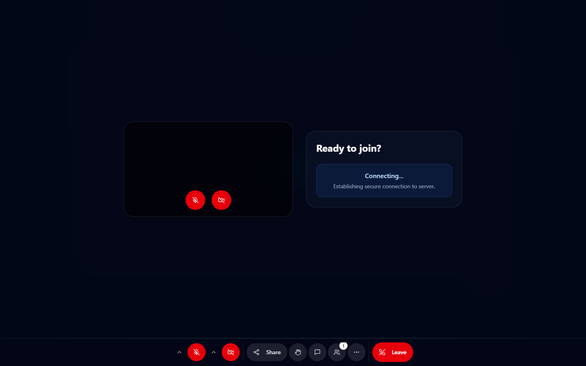

# TSMeet User Guide

Everything you can do in TSMeet as a host, a participant, or someone booking a
meeting. No server knowledge needed — if someone has already set TSMeet up for
you, start here.

**Contents**

- [Accounts and signing in](#accounts-and-signing-in)
- [Starting a meeting](#starting-a-meeting)
- [Inviting people](#inviting-people)
- [Joining a meeting](#joining-a-meeting)
- [Inside the meeting](#inside-the-meeting)
- [Sharing your screen](#sharing-your-screen)
- [Hosting: the participants panel](#hosting-the-participants-panel)
- [Hosting: moderation controls](#hosting-moderation-controls)
- [Recording a meeting](#recording-a-meeting)
- [Booking pages and calendars](#booking-pages-and-calendars)
- [Your dashboard](#your-dashboard)
- [Troubleshooting](#troubleshooting)

---

## Accounts and signing in

| Page | What it is for |
|---|---|
| `/auth/register` | Create an account with email, password, and display name |
| `/auth/login` | Sign in |
| `/dashboard` | Your meetings, calendars, and recordings |

Passwords must be at least 8 characters. Your session is kept in a secure cookie
that JavaScript cannot read, and it is what keeps you signed in — there is no
token to copy or paste anywhere.

**You do not need an account to join a meeting.** Anyone with the link can join
as a guest; see [Joining a meeting](#joining-a-meeting).

---

## Starting a meeting

1. Sign in and go to your **dashboard**.
2. Create a room. Give it a title and, optionally, a description.
3. Optionally set a **room password**. Anyone joining who is not you will be
   asked for it before they even reach the waiting room.
4. You are taken into the room and you are the **host**.

The person who creates a room is permanently its owner. If your connection drops
and someone else temporarily becomes host, you reclaim host automatically when
you rejoin.

---

## Inviting people

Inside a meeting, use the **copy-link** button in the top bar, or **Invite** in
the participants panel. Send that link to anyone.

If you set a room password, send it separately — it is not part of the link.

---

## Joining a meeting

  

Open the link. Then:

1. **Enter your name.** Guests are asked for a display name. You can change it
   later.
2. **Enter the room password**, if the host set one.
3. **Wait to be admitted.** You will see a waiting message until the host lets
   you in. If the host has not arrived yet, you wait for them.
4. Once admitted, your camera and microphone connect.

Before joining you can preview your camera and microphone and pick which
devices to use.

| What you see | What it means |
|---|---|
| "Waiting for the host" | The host has not joined or has not admitted you yet |
| "Password required" | The room is password-protected |
| "This meeting is locked" | The host locked the room to new joiners |
| "Room is full" | The participant limit was reached |
| "Meeting has ended" | The host ended it for everyone |

---

## Inside the meeting

  

The toolbar along the bottom holds your main controls.

| Control | What it does |
|---|---|
| Microphone | Mute and unmute yourself. The small arrow opens the input-device list |
| Camera | Turn your video on and off. The arrow opens the camera list |
| Share | Share a screen, window, or tab — see [Sharing your screen](#sharing-your-screen) |
| System audio | Include computer sound with your share |
| Raise hand | Signal the host without interrupting |
| Chat | Open the in-meeting chat panel |
| Fullscreen | Expand the meeting to fill your screen |
| Leave | Leave the meeting (the meeting continues for everyone else) |

**Layouts.** Use the view switcher (labelled *Gallery view*) to change how tiles
are arranged:

- **Gallery** — everyone in a grid
- **Active speaker** — whoever is talking fills the stage
- **Pinned** — you choose one person to stay large, from the participants panel

**Hide me / Hide my tile** removes your own preview from your view. Everyone else
still sees you — it only declutters your screen.

**Network quality** is shown in the top bar. TSMeet automatically lowers video
quality when your connection degrades, and there is a low-data mode for slow
connections.

**Mobile.** The layout works down to 320 px wide, with the same controls in a
compact toolbar.

  

---

## Sharing your screen

  

Press **Share** and pick:

- **Screen or window** — shares video only.
- **Screen with system audio** — also shares sound from the tab or screen. Use
  this when you are playing a video or demoing something with audio.

Your browser then asks which screen, window, or tab to share.

> System audio is not available everywhere. Chrome on Windows can share whole-
> screen and tab audio; some browsers and some capture targets only offer tab
> audio, and others offer none. If the option is greyed out, your browser or the
> target you picked does not support it.

Press **Share** again to stop.

---

## Hosting: the participants panel

  

Open it from the people icon in the top bar. It shows everyone in the meeting,
with:

- a **search** box for large meetings
- an **Invite** button that copies the meeting link
- badges for **host**, **muted**, and **raised hand**
- per-person **mute** and **pin** buttons
- the **waiting list**, when people are asking to join

**Admitting people.** When someone asks to join, you get a request in this panel.
Admit them, deny them, or use **Admit all** to clear the queue. A denied person
can ask again.

---

## Hosting: moderation controls

Available to the host and to anyone the host promotes to co-host.

| Control | Effect |
|---|---|
| **Mute** | Mutes one participant. They can unmute themselves unless they ask first |
| **Mute all** | Mutes everyone except you |
| **Stop video** | Turns off one participant's camera |
| **Remove** | Ejects a participant from the meeting |
| **Lock meeting** | No new people can join, even with the link |
| **Make co-host** | Gives someone the moderation controls above |
| **Transfer host** | Hands over ownership of the meeting |
| **End meeting** | Ends it for everyone and disconnects all media |

**Unmute requests.** A muted participant can request to unmute. You approve or
deny it, so nobody talks over a presentation unexpectedly.

**Co-host vs host.** Co-hosts can moderate. Only the host can lock the meeting,
transfer host, promote or demote co-hosts, and end the meeting for everyone.

Every moderation action is written to an audit log on the server.

---

## Recording a meeting

Only the host can record, and recording happens **on the server** — it does not
depend on your laptop staying awake or your browser staying open.

**Starting.** Press **Record**. You will be asked to confirm that participants
consent to being recorded. Recording does not start until you confirm.

**During.** Use **Pause**, **Resume**, and **Stop recording**. Everyone in the
meeting sees that recording is active.

**Afterwards.** The recording appears in **Dashboard → Recordings**, where you
can play it, download it, or delete it. Recordings are private to you: the
storage is not publicly readable, and download links are generated per request
and expire quickly.

| Situation | What happens |
|---|---|
| You pause and resume | You still get one recording; it is stored in segments internally |
| You leave but the meeting continues | Recording continues — it is not tied to your browser |
| Storage is full | Starting or resuming fails with a storage-quota error |

If the meeting was booked through a calendar with **auto-record** enabled, you
are prompted to start recording when you enter the room. It still requires your
confirmation — nothing records silently.

---

## Booking pages and calendars

Calendars let other people book time with you, without an account.

**Creating one.** Go to **Calendars → Create**. You choose:

| Setting | What it controls |
|---|---|
| Title, description, timezone | How the public page reads |
| Slug | The public URL, e.g. `/calendars/consultation` |
| Availability | Which hours you accept bookings on each weekday |
| Slot duration and interval | How long each meeting is, and how often slots start |
| Booking window | How far ahead people may book |
| Daily slot limit | Maximum bookings per day |
| Holidays and disabled slots | One-off blocked dates and times |
| Booking form | Extra questions to ask the person booking |
| Confirmation message | What they see after booking |
| Auto-record prompt | Whether the meeting room offers to record on entry |

**Calendar types**

| Type | Use it when |
|---|---|
| **Personal** | One-to-one meetings; each slot takes one booking |
| **Event** | Group sessions; each slot takes up to a capacity you set |
| **Round robin** | A team shares the load; each booking is assigned to an available member |

Round-robin members can each have their own weekly availability, so a slot is
only offered when at least one member is actually free.

**Sharing.** Every calendar has a public page and an embeddable version for your
own website. When someone books, they get a confirmation and a meeting link.

**Managing bookings.** **Calendars → Manage → Bookings** lists what has been
booked, filterable by date and status, and lets you cancel with a reason.

> Two people cannot take the last remaining slot. The server serialises booking
> checks per calendar, so the second request is rejected rather than
> double-booked.

---

## Your dashboard

| Section | What is there |
|---|---|
| Meetings | Rooms you created, and their history |
| Calendars | Your booking pages and their bookings |
| Recordings | Your private recording archive with download and delete |
| API docs | Reference for building against TSMeet |

---

## Troubleshooting

**I can't be heard, or I can't see anyone.**
Check that your browser has camera and microphone permission for the site. Then
open the device menus next to the microphone and camera buttons and confirm the
right hardware is selected — a headset that was unplugged mid-call is the usual
cause.

**My video is frozen or blocky.**
TSMeet lowers quality automatically on a weak connection. Turning your camera off
frees capacity for audio. If it persists, a wired connection or a different
network usually resolves it.

**I'm stuck on "waiting for the host".**
The host has not joined or has not admitted you. There is nothing to fix on your
side — the request stays queued until they respond.

**"This meeting is locked."**
The host locked the room. Ask them to unlock it or admit you directly.

**Screen share has no sound.**
You must pick **Screen with system audio**, and your browser and the thing you
are sharing must both support it. Sharing a whole screen on some browsers offers
no audio at all; try sharing the specific tab instead.

**I was removed or the meeting ended abruptly.**
A host can remove a participant or end the meeting for everyone. Both are
deliberate actions, not errors.

**Nothing loads at all.**
If you see "Backend server is unavailable", the person hosting TSMeet has a
service down — that is a server-side problem, not something you can fix in the
browser. Point them at
[docs/OPERATIONS_HANDBOOK.md](OPERATIONS_HANDBOOK.md).
